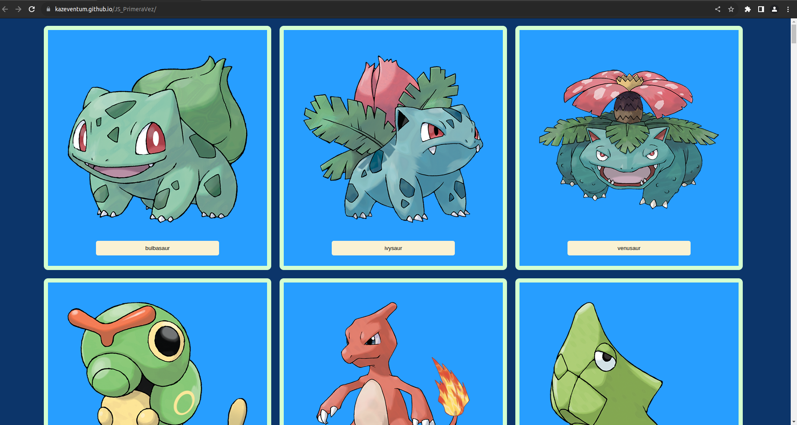
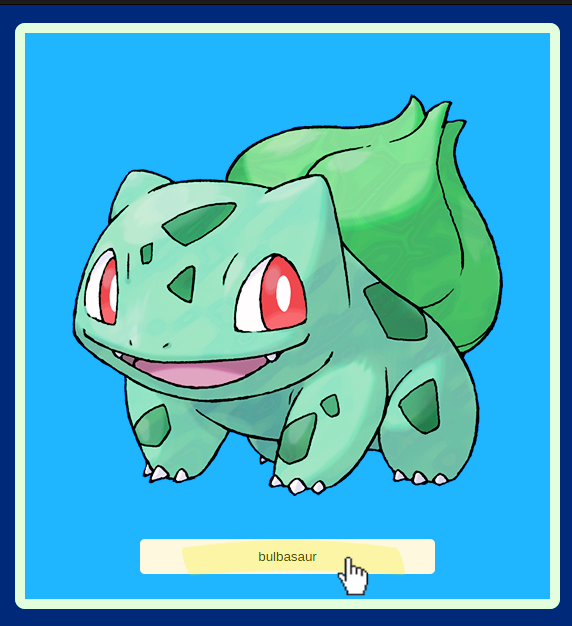
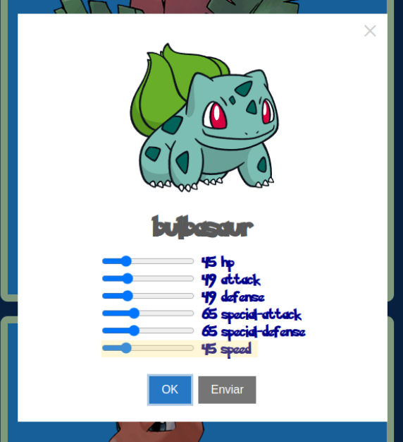
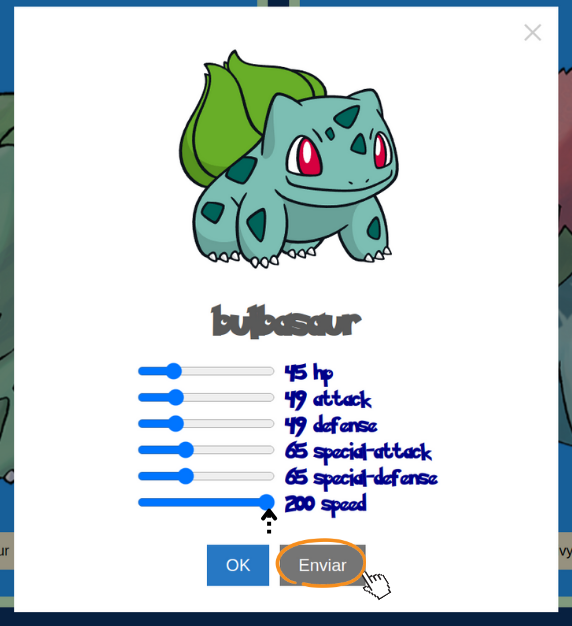
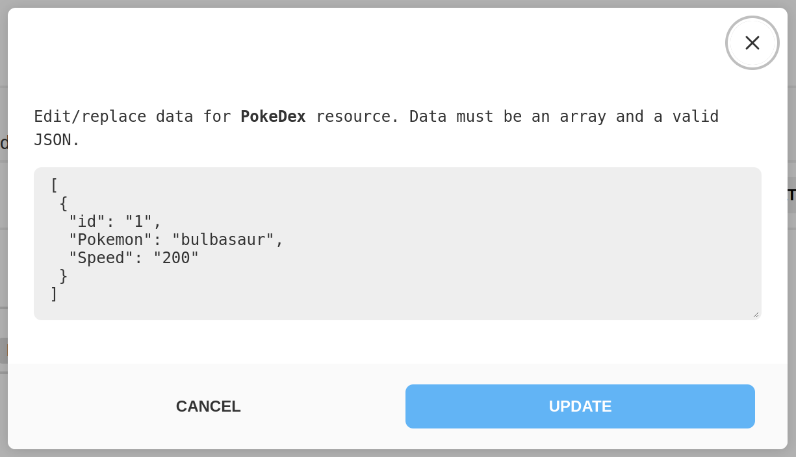
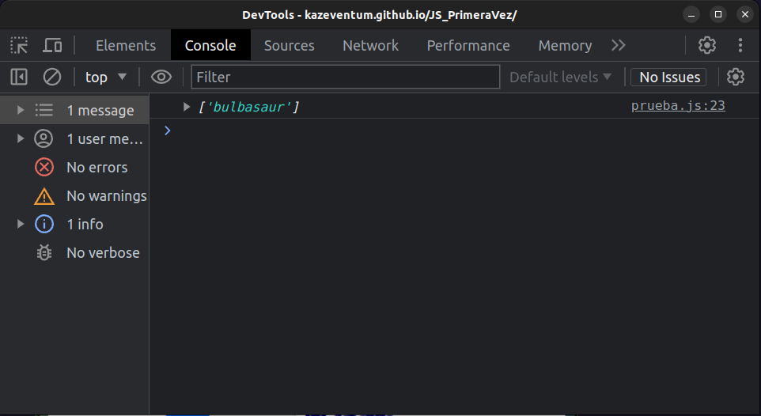
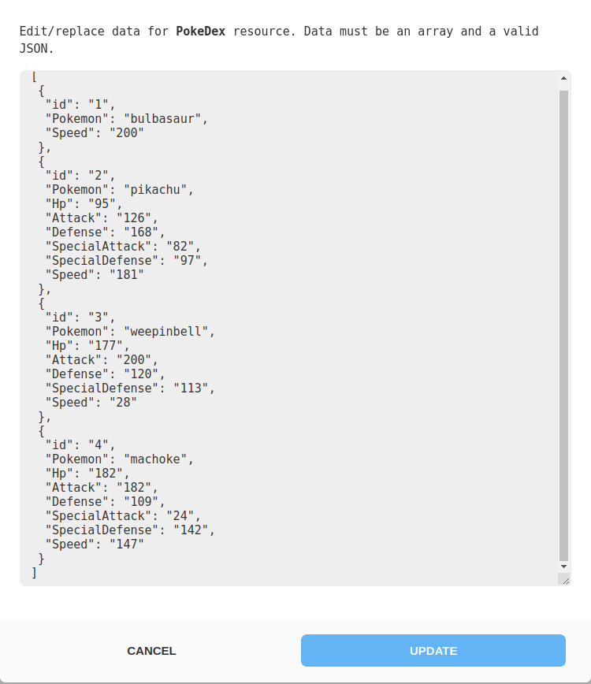
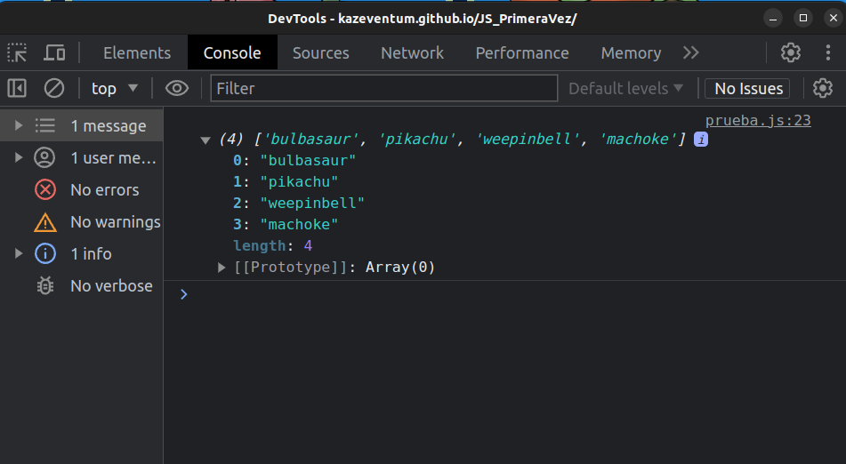

# PokeDex-Example

Este proyecto es un ejemplo de una aplicación web llamada "PokeDex" que muestra información sobre Pokémon. Incluye archivos HTML, JavaScript y CSS para su funcionamiento. A continuación, se describe la estructura y los archivos clave del proyecto.

## Estructura de Archivos

### `index.html`

Este archivo HTML es la página principal de la aplicación. Define la estructura básica de la página, carga los estilos y scripts necesarios, y proporciona el esqueleto de la interfaz de usuario de la PokeDex.

### `prueba.js`

El archivo JavaScript `prueba.js` contiene las funciones y la lógica de la aplicación. Estas funciones incluyen consultas a una API para obtener información sobre Pokémon, la creación dinámica de tarjetas de Pokémon y la interacción del usuario con las estadísticas de Pokémon.

### `style.css`

El archivo CSS `style.css` define los estilos visuales de la aplicación. Esto incluye la apariencia de las tarjetas de Pokémon, la disposición de los elementos y la personalización de la interfaz.

## Configuración y Uso

1. Descarga o clona este repositorio en tu máquina local.

2. Abre el archivo `index.html` en tu navegador web para ejecutar la PokeDex.

3. PokeDex se cargará y mostrará la informacion de los Pokemones.

4. Selecciona un pokemon, en este caso sera "Bulbasaur" y da click en el boton con su nombre.

5. PokeDex cargará la estadisticas de tu pokemon y podras verlas en pantalla. PokeDex permite editar las estadisticas. Editaremos **Speed**.

6. La estadistica speed ahora vale 200, si quieres guardar la estadistica puedes dar click en el boton **Enviar**

7. Al enviar, las estadisticas editadas serán enviadas a MockAPI y guardas. Para **visualizar** que Pokemones tuvieron cambios en tus estadisticas
**abre la consola del navegador**

---

8. Cualquier cambio en las estadisticas se irá actualizando en *MockAPI* y en la consola de *PokeDex*

---

## Dependencias

Este proyecto utiliza las siguientes bibliotecas externas:

- [SweetAlert2](https://sweetalert2.github.io/): Se utiliza para mostrar ventanas modales personalizadas y notificaciones.

## Contribución

¡Eres bienvenido/a a contribuir a este proyecto! Si deseas proponer mejoras o correcciones, puedes abrir problemas (issues) o enviar solicitudes de extracción (pull requests).

## Notas

- Actualmente este proyecto esta en su penultima fase la cual es **Enviar Datos modificados de las estadisticas del Pokemon a MockAPI** (Terminada con Exito)

- La ultima fase en la que la aplicacion debe **Mostrar los datos modificados de vuelta solo de MockAPI** no ha sido posible realizarse aún ya que requiere pruebas y estudio para poderse hacer realidad. (Sigue en Proceso.)

## Licencia

Este proyecto se encuentra bajo la Licencia MIT. Consulta el archivo [LICENSE](LICENSE) para obtener más detalles.

---

¡Gracias por revisar este README! Si tienes alguna pregunta o necesitas más información sobre este proyecto, no dudes en contactarme.

@KazeVentum
