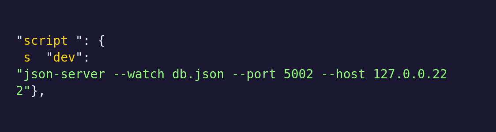
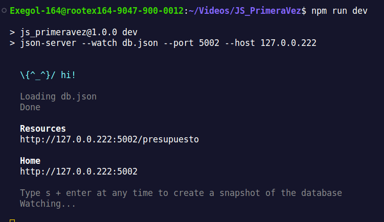
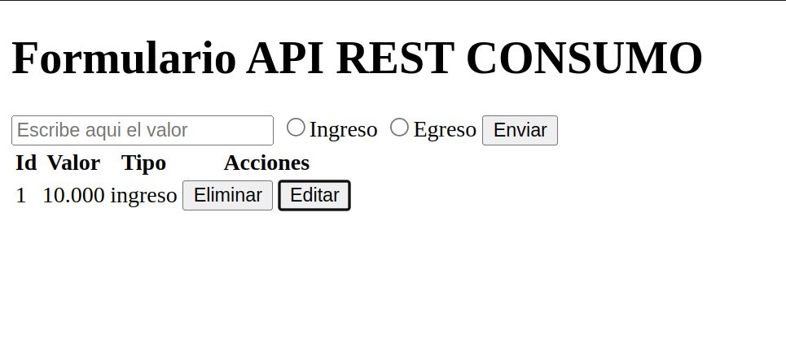
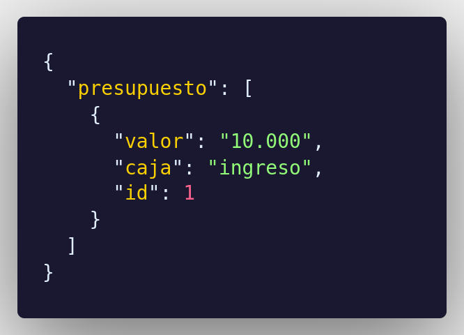

# Presupuesto Ejercicio.

Este proyecto se basa en la conexion a la base de datos json-server y el ejercicio anterior en clase de "Presupuesto" donde el usuario ingresa una cantidad de dinero, escoge una categoria y al dar click en el boton enviar la información se carga en la base de datos y lo muestra por medio de una tabla.

## Estructura de archivos

### `index.html`

Este archivo HTML es la página principal de la aplicación. Define la estructura básica del ejercicio, permite ingresar una cantidad de dinero y muestra el registo de ingresos o egresos.

### `main.js`

El archivo JavaScript ` main.js` contiene las funciones y la lógica de la aplicación. Estas funciones incluyen consulta a una API para obtener información de registro, la creación de nuevos registros y la interacción del usuario con los datos del registro al momento de editar.

### `db.json`

El archivo db (database) ` db.json` define como tal la base de datos donde son guardados todos los registros, aqui es donde el programa se comunica y este le permite la obtencion de datos.

### `package.json`

El archivo package json ` package.json` contiene la configuración basica de la base datos, contiene parametros como "Tipo", "Nombre de la base de datos" y "Host & port".

## Configuración y Uso

1. Descarga o clona este repositorio en tu máquina local.
---
2. El archivo package.json trae una configuración por defecto de conexion que es el siguiente.
    
    Puedes modificar si deseas el puerto o la IP desde las opciones `--host` o `--port`, (recuerda usar la configuración de pruebas de IP).
---
3. La base de datos de este proyecto es `json-server`, para inicializarla sigue estos pasos.
    - Escribe en tu terminal dentro de la carpeta del repositorio este comando.
        ~~~ bash
        npm -E -D install json-server
        ~~~
        > Este comando instalará las dependencias necesarias (json-server).
    - Se creará una carpeta llamada dos carpetas importantes.
        - node_modules
        - package-lock.json.
    ---
4. Luego abriras tu terminal y escribiras el siguiente comando:
    ~~~ bash
        npm run dev
     ~~~
     > Este comando creará la base de datos local.

     - sabras que se ejecutó correctamente si te aparece este mensaje.
    

5. Abre el archivo `index.html` en tu navegador web.

6. Ingresa un valor que desees con la opcion correspondiente y dale al boton enviar.

7. **¡Tienes el programa funcionando!**, recuerda que puedes editar, eliminar o ingresar cuantos valores desees
        
        
    > Al agregar cualquier valor este será enviado a db.json.
    
    

---

## Licencia

Este proyecto se encuentra bajo la Licencia MIT. Consulta el archivo [LICENSE](LICENSE) para obtener más detalles.

---

¡Gracias por revisar este README! Si tienes alguna pregunta o necesitas más información sobre este proyecto, no dudes en contactarme.

@KazeVentum